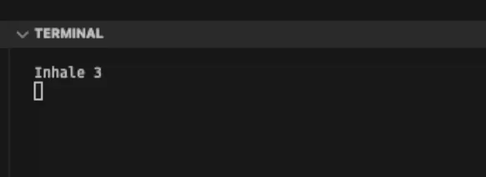

# Calm Garden (CLI)

Enhance your relaxation and focus with this command-line interface (CLI) application for breathing exercise. Practice this powerful technique while growing a virtual garden, making your stress-reduction journey both enjoyable and rewarding.


## 🤔 Why CLI?

- 🔇 Discreet: Practice box breathing right from your terminal without drawing attention.
- ⏱️ Quick Breaks: Easily take short breathing breaks during work without switching contexts.
- 🚫 Distraction-Free: No flashy graphics or notifications to disrupt your focus.
- 🖥️ Always Accessible: If you have access to a terminal, you have access to your breathing exercises.
- 🛡️ Privacy: Practice self-care without anyone knowing or interrupting you.


## 🌟 Features

- 🕒 Customizable box breathing exercises with adjustable duration
- 📊 Progress tracking to monitor your practice
- 🌱 Virtual garden to visualize your growth
- 🛍️ In-app shop to acquire new plants for your garden
- 💰 Coin system to reward consistent practice

## Available Breathing Techniques

Calm Garden CLI offers several breathing techniques to help you reduce stress and improve focus:

1. **Box Breathing**: Also known as square breathing, this technique involves inhaling, holding, exhaling, and holding again, each for 4 seconds.

2. **Physiological Sigh**: This technique mimics a natural stress-relieving breath pattern, involving two quick inhales followed by a longer exhale.

3. **Pranayama (4-7-8)**: A yogic breathing technique that involves inhaling for 4 seconds, holding for 7 seconds, and exhaling for 8 seconds.

4. **Coherent Breathing**: A simple technique that involves 

Choose the technique that best suits your needs and start your journey to inner calm!

## 🖼️ Screenshots

Breathing exercise:



Progress visualized as a garden:


Shop:


## 🚀 Installation

Install the app:

```bash
npm i -g calm-garden-cli
```

## 🏁 Quick Start

To open CLI menu, just type:

```bash
calm-garden-cli
```

## 💡 Why Box Breathing?

Box breathing, also known as square breathing, is a simple yet effective technique to:
- Reduce stress and anxiety
- Improve focus and concentration
- Enhance overall well-being

Start your journey to better mental health today!


🌿 How to Use
1.
Start a Breathing Session: Choose the duration and follow the on-screen prompts.
2.
Track Your Progress: View your practice history and achievements.
3.
Grow Your Garden: Earn coins through consistent practice.
4.
Shop for Plants: Use your earned coins to buy new plants for your virtual garden.

## 💾 Data Storage

Your progress and garden data are stored locally on your machine using the node-persist library. The data is typically saved in a `.node-persist` directory within your home folder (e.g., `~/.node-persist/` on Unix-like systems or `C:\Users\YourUsername\.node-persist\` on Windows). This ensures your data persists between sessions, allowing you to track your long-term progress.

## 🛠️ Development

To set up the project for development:

1.
Clone the repository:
git clone https://github.com/jaroslaw-weber/cli-box-breathing.git
2.
Install dependencies:
npm install
3.
Run the app in development mode:
npm run start


🤝 Contributing
We welcome contributions! To contribute:

1.
Fork the repository
2.
Create your feature branch (git checkout -b feature/AmazingFeature)
3.
Commit your changes (git commit -m 'Add some AmazingFeature')
4.
Push to the branch (git push origin feature/AmazingFeature)
5.
Open a Pull Request

📄 License
This project is licensed under the MIT License - see the LICENSE file for details.
